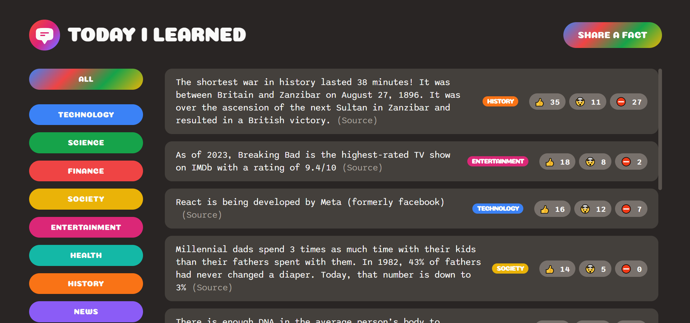

# Today I Learned Application

This application is designed to be user-friendly and allows users to easily create and view facts. It provides a categorized display of factual information along with their sources. Users can also participate in a voting system to express their preferences for each fact. Additionally, the application allows users to contribute their own facts, making it a dynamic platform for knowledge-sharing.

## Table of contents

- [Overview](#overview)
  - [Features](#the-challenge)
  - [Screenshot](#screenshot)
  - [Links](#links)
- [My process](#my-process)
  - [Built with](#built-with)
  - [Continued development](#continued-development)
  - [What I learned](#what-i-learned)
- [Author](#author)

## Overview

### Features

Today I Learned application main features:

- User-Friendly Interface: The application is designed to be intuitive and easy to use, ensuring a positive user experience.
- Fact Creation and Viewing: Users can effortlessly create and view facts within the application, promoting the discovery of new information.
- Categorized Display: The factual information is organized into categories, allowing users to browse and explore facts based on their interests.
- Source Attribution: Each fact is accompanied by its respective source of information, enhancing credibility and transparency.
- Voting System: Users have the ability to participate in a voting system, enabling them to express their preferences and opinions on each fact.
- User Contributions: The application provides a platform for users to contribute their own facts, fostering a collaborative environment for knowledge-sharing.
- Dynamic Knowledge-Sharing: With the inclusion of user-contributed facts, the application offers a constantly evolving and diverse range of information.

### Screenshot

### Links

Please change your IP, if you are in Iran.

- Live on: [Netlify](https://todayilearned-parham.netlify.app/)

## My process

### Built with

- ES6
- Supabase
- React.js
- CSS3
- HTML5

### Continued development

Some features and improvments that will be added to the Today I Learned app in the future:

- Sort the facts based on votes numbers (Under development)
- Implement an authentication system that allows only logged-in users to vote. (Under development)

### What I learned

In this project, I utilized Supabase to create the database and backend for this application.

## Author

- Linkedin - [@parham-tavakolian](https://www.linkedin.com/in/parham-tavakolian/)
